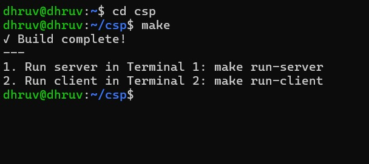
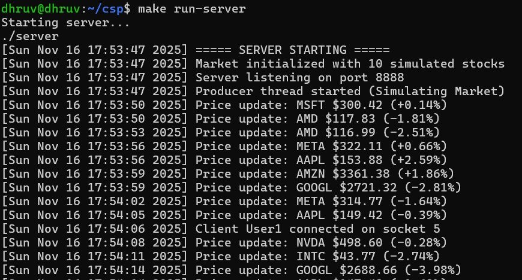
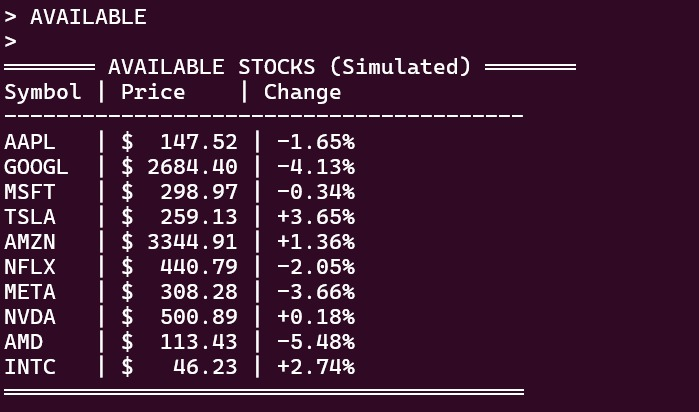
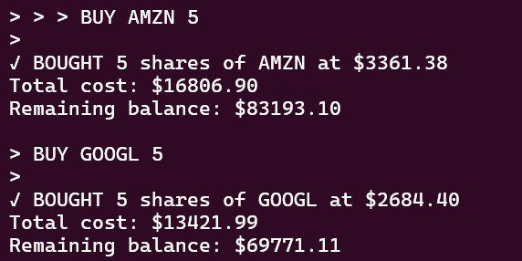
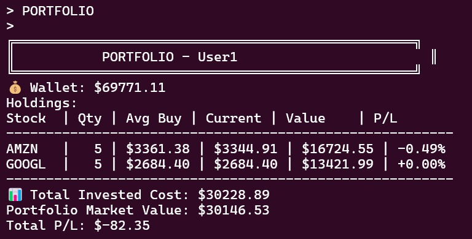
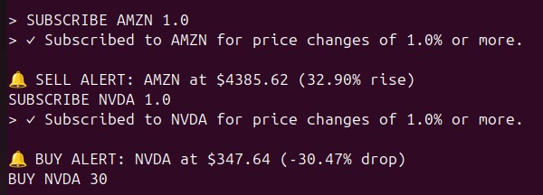

# 📦 Stock Trading System — README

This README shows how to build and run the multithreaded **C** server & client trading simulator and includes **command examples with their expected outputs**.

---

## Project files

- server.c — Server implementation
- server.h — Server header (structures & prototypes)
- client.c — Client implementation
- client.h — Client header
- Makefile — Build/run helper
- server.log — Runtime log (generated automatically)

---

## Build

make
make clean

---

## Run

### Terminal 1 — Start server
make run-server

### Terminal 2 — Start client
make run-client
# or connect to remote
./client 192.168.1.10

---

## Commands & Examples

(All commands are typed in the client terminal.)

---

### 1) AVAILABLE — List all simulated stocks

Command:
AVAILABLE

Output:

>

---

### 2) BUY <symbol> <qty>

Command:
BUY AMZN 5

Output:

>

Errors:
ERROR: Invalid quantity
ERROR: Stock AAPL not found
ERROR: Insufficient funds. Need $150000.00, have $100000.00

---

### 3) SELL <symbol> <qty>

Command:
SELL AAPL 5

Output:
✓ SOLD 5 shares of AAPL at $152.00
Proceeds: $760.00
Profit/Loss: +$10.00 (1.33%)
New balance: $99260.00

>

Errors:
ERROR: You don't own AAPL
ERROR: You only have 3 shares of AAPL

---

### 4) PORTFOLIO

Command:
PORTFOLIO

>

---

### 5) SUBSCRIBE <symbol> [threshold]

---

## Example Full Workflow

AVAILABLE
BUY AAPL 10
PORTFOLIO
SUBSCRIBE AAPL 2.0
# alerts appear automatically

---

## Logging (server.log)

Example entries:
[Mon Nov 16 19:40:05 2025] Market initialized with 10 simulated stocks
[Mon Nov 16 19:40:20 2025] Price update: AAPL $142.30 (-5.20%)
[Mon Nov 16 19:40:22 2025] Client User1 bought 10 AAPL at $150.00

---

## Troubleshooting

Server full → Increase MAX_CLIENTS in server.h  
No alerts → SUBSCRIBE AAPL 1.0  
Client seems stuck → Press Enter  
Watch logs → tail -f server.log  

---

## Future Enhancements

- SQLite persistent storage
- User authentication
- Web dashboard (WebSockets)
- Historical charts and analytics
